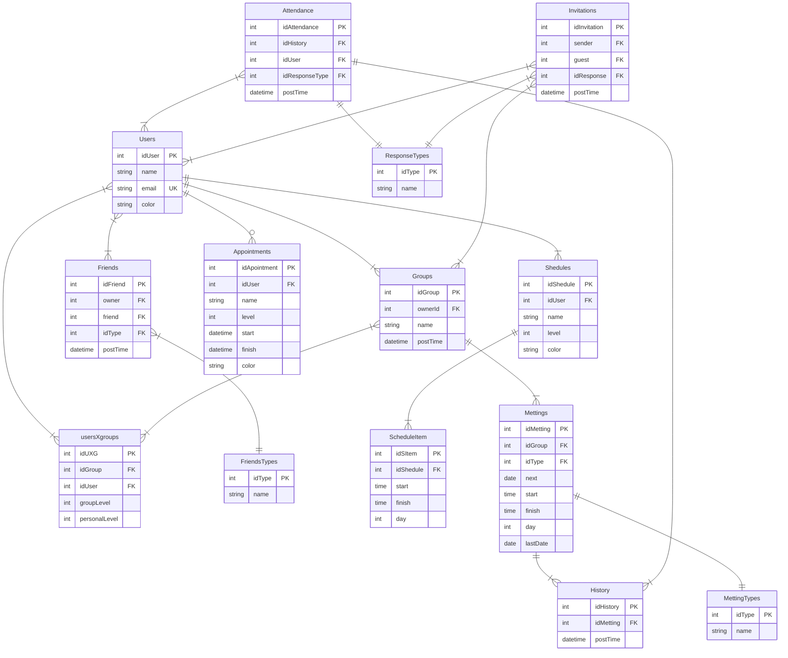
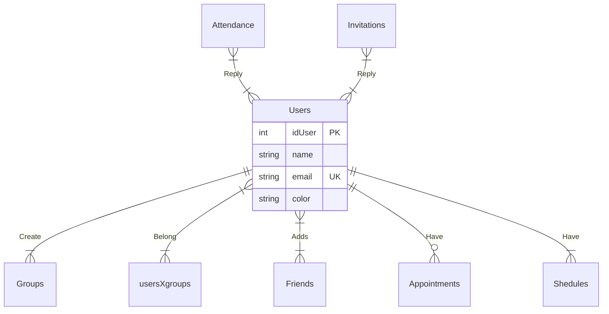
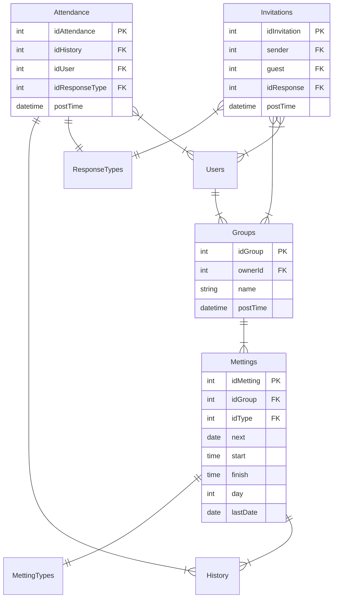
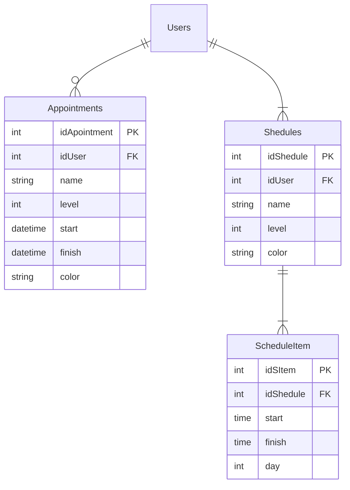

# Design of DB for Supabase

## Users
In the provided database schema, the users entity appears to be a central part of the database structure, as connections between users are a significant aspect and a primary focus of the application. The various relationships and associations involving the "Users" entity, such as connections with groups, friends, appointments, schedules, attendance, and invitations, highlight the importance of user interactions and relationships in the application's functionality.
- idUser (PK): This is the primary key that uniquely identifies each user in the database.
- name: This attribute represents the name of the user.
- email (UK): The email attribute is a unique key, ensuring that each user has a distinct email address.
- color: Each user is associated with a color, which will be reflected in the groups when a gradient is applied using the colors of the group members.
Used to ...

## Groups and Mettings
The system allows users to create groups, join existing groups, and participate in meetings within those groups. Users have the flexibility to decide their participation in groups and meetings, making it a versatile and user-centric system for group collaboration and communication.

## Appointments and Schedules
Likewise, the system individually allows users to define their schedules ("Schedules") and one-time events ("Appointments"), enabling the system to notify users if there is a schedule conflict when they want to accept a meeting, a one-time event, or adjust their schedule. At the same time, the system is designed to provide suggestions that do not conflict with users' schedules, one-time events, and meetings when they request proposals.

