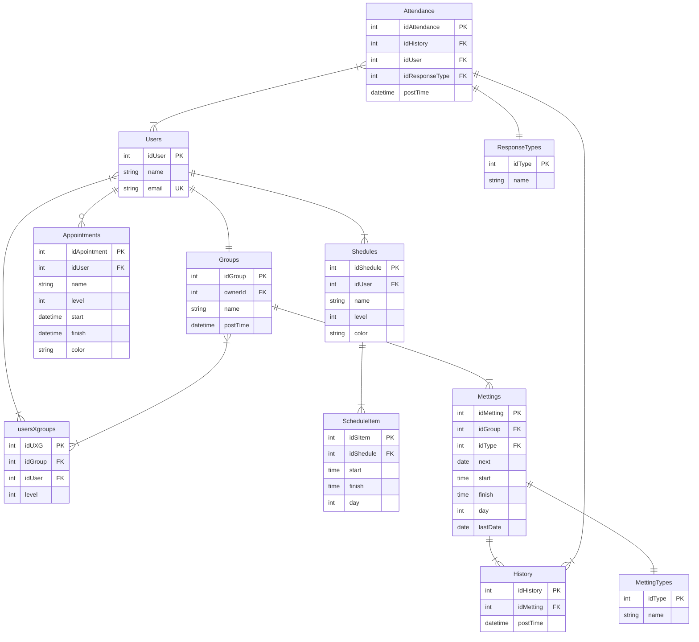

# Design of DB for Supabase

```mermaid
erDiagram
  Users{
    int idUser PK
    string name
    string email UK
  }
  Groups {
    int idGroup PK
    int ownerId FK
    string name 
    datetime postTime
  }
  usersXgroups{
    int idUXG PK
    int idGroup FK
    int idUser FK
    int level 
  }
  Users ||--||Groups: ""
  Users }|--|{  usersXgroups: ""
  Groups }|--|{  usersXgroups: ""
  Appointments{
    int idApointment PK
    int idUser FK
    string name
    int level
    datetime start
    datetime finish
    string color 
  }
  Users ||--o{ Appointments: ""
  Shedules{
    int idShedule PK
    int idUser FK
    string name
    int level
    string color
  }
  Users ||--|{ Shedules: ""
  ScheduleItem{
    int idSItem PK
    int idShedule FK
    time start
    time finish
    int day
  }
  Shedules ||--|{ ScheduleItem: ""
  Mettings{
    int idMetting PK
    int idGroup FK
    int idType FK
    date next
    time start
    time finish
    int day
    date lastDate
  }
  MettingTypes{
    int idType PK
    string name
  }
  Mettings ||--||  MettingTypes: ""
  Groups ||--|{  Mettings: ""
  History{
    int idHistory PK
    int idMetting FK
    datetime postTime
  }
  Mettings ||--|{ History: ""
  Attendance{
    int idAttendance PK
    int idHistory FK
    int idUser FK
    int idResponseType FK
    datetime postTime
  }
  ResponseTypes{
    int idType PK
    string name
  }
  Attendance ||--|{ History: ""
  Attendance ||--|| ResponseTypes: ""
  Attendance }|--|{ Users: ""
```
## something 